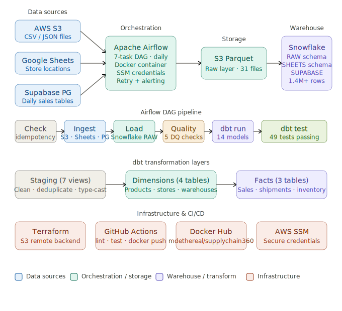

# SupplyChain360 Data Platform

A production-grade end-to-end data engineering pipeline for SupplyChain360, a retail distribution company managing product distribution across hundreds of US stores.

## Architecture Overview



**Pipeline flow:** Sources -> Airflow (7-task DAG) -> S3 Parquet -> Snowflake RAW -> dbt -> Facts

**7-task Airflow pipeline:**
```
check_idempotency -> migrate_s3_files -> migrate_google_sheets -> migrate_supabase -> load_to_snowflake -> data_quality_checks -> run_dbt_models
```


## Tech Stack

| Layer | Technology |
|---|---|
| Orchestration | Apache Airflow 2.8.1 (Docker) |
| Data Warehouse | Snowflake |
| Transformation | dbt (dbt-snowflake 1.11.3) |
| Infrastructure | Terraform |
| Cloud | AWS (S3, SSM Parameter Store) |
| Containerization | Docker + Docker Hub |
| CI/CD | GitHub Actions |
| Version Control | Git + GitHub |

## Project Structure
```
airflow-pipeline/
├── dags/
│   ├── pipeline_dag.py          # Main Airflow DAG (5 tasks)
│   ├── supplychain360/          # dbt project
│   │   ├── models/
│   │   │   ├── staging/         # 7 staging views
│   │   │   ├── dimensions/      # 4 dimension tables
│   │   │   └── facts/           # 3 fact tables
│   │   └── dbt_project.yml
│   └── credentials.json         # Google Sheets (gitignored)
├── terraform/
│   ├── main.tf                  # Remote backend (S3)
│   ├── variables.tf
│   ├── outputs.tf
│   └── modules/
│       ├── aws/                 # S3 + SSM Parameter Store
│       └── snowflake/           # Database + Schemas + Warehouse
├── .github/
│   └── workflows/
│       └── ci_cd.yml            # GitHub Actions CI/CD
├── Dockerfile                   # Custom Airflow image
├── docker-compose.yml           # Local development
└── .gitignore
```

## Data Pipeline

The Airflow DAG `data_pipeline` runs daily with 5 tasks in sequence:
```
migrate_s3_files >> migrate_google_sheets >> migrate_supabase >> load_to_snowflake >> run_dbt_models
```

### Data Sources
- **S3** — 17 CSV/JSON files (inventory, products, shipments, suppliers, warehouses)
- **Google Sheets** — 800 rows of store data
- **Supabase PostgreSQL** — 200,000+ rows (sales, trips, drivers, riders, payments)

### Snowflake Schemas
| Schema | Description | Tables |
|---|---|---|
| RAW | Raw data loaded from S3 | INVENTORY, PRODUCTS, SHIPMENTS, SUPPLIERS, WAREHOUSES |
| SHEETS | Data from Google Sheets | SHEET1 (stores) |
| SUPABASE | Data from Supabase | SALES, TRIPS_RAW, DRIVERS_RAW, RIDERS_RAW, etc. |
| DBT_DEV_STAGING | Cleaned staging views | 7 models |
| DBT_DEV_DIMENSIONS | Dimension tables | dim_products, dim_suppliers, dim_warehouses, dim_stores |
| DBT_DEV_FACTS | Fact tables | fct_sales, fct_shipments, fct_inventory |

### Data Volume
- **258,928 total rows** across 13 raw tables
- **200,000** sales transactions
- **50,000** shipments
- **8,000** inventory snapshots

## dbt Models

### Staging (Views)
- `stg_products` — cleaned products with type casting
- `stg_suppliers` — normalized supplier data
- `stg_warehouses` — warehouse locations
- `stg_stores` — store data from Google Sheets
- `stg_inventory` — inventory with `is_below_threshold` flag
- `stg_shipments` — shipments with `delivery_delay_days` and `is_late` flag
- `stg_sales` — sales with `net_sale_amount` calculation

### Dimensions (Tables)
- `dim_products` — products joined with supplier info
- `dim_suppliers` — supplier reference table
- `dim_warehouses` — warehouse reference table
- `dim_stores` — store reference table with region

### Facts (Tables)
- `fct_sales` — 200,000 sales transactions enriched with store and product info
- `fct_shipments` — 50,000 shipments with delivery performance metrics
- `fct_inventory` — 8,000 inventory snapshots with stock ratio

## Infrastructure (Terraform)

- **S3 source bucket** — `migrated-supplychaindata360-030179311135-eu-west-2-an`
- **S3 destination bucket** — `supplychain360-parquet-eu-west-2` (Parquet files)
- **S3 state bucket** — `supplychain360-terraform-state` (Terraform remote backend)
- **SSM Parameter Store** — all credentials stored as SecureString
- **Snowflake** — database, warehouse, and schemas managed by Terraform

## CI/CD (GitHub Actions)

On every push to `main`:
1. **dbt Tests** — runs all 16 dbt data quality tests against Snowflake
2. **Docker Build & Push** — builds and pushes `mdethereal/supplychain360-airflow:latest`
3. **Terraform Validate** — validates all Terraform configuration

## Security

- All credentials stored in **AWS SSM Parameter Store**
- No secrets in code or Git history
- `.env` and `terraform.tfvars` are gitignored
- Docker image uses non-root `airflow` user

## Setup

### Prerequisites
- Docker + Docker Compose
- AWS CLI configured
- Terraform >= 1.7.0
- dbt-snowflake

### Run locally
```bash
git clone https://github.com/MDCODE247/supply_chain_plartform.git
cd supply_chain_plartform
cp .env.example .env  # fill in your credentials
docker compose up -d
```

### Run dbt manually
```bash
cd supplychain360
dbt run
dbt test
dbt docs generate && dbt docs serve
```

### Apply Terraform
```bash
cd terraform
terraform init
terraform plan
terraform apply
```

## Author
Mohammed | [GitHub](https://github.com/MDCODE247)
